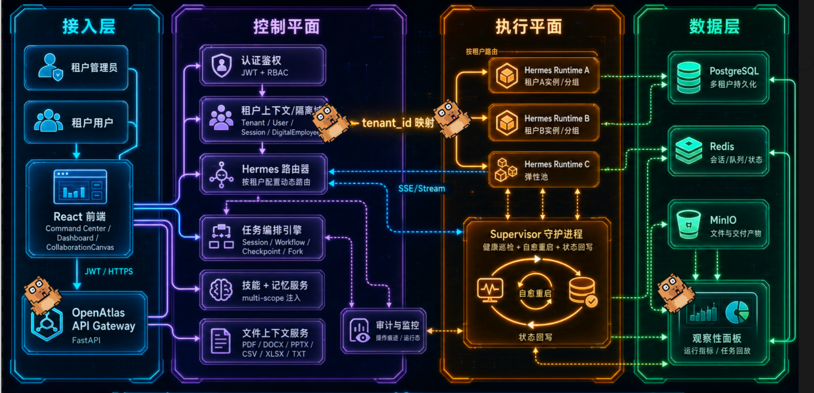
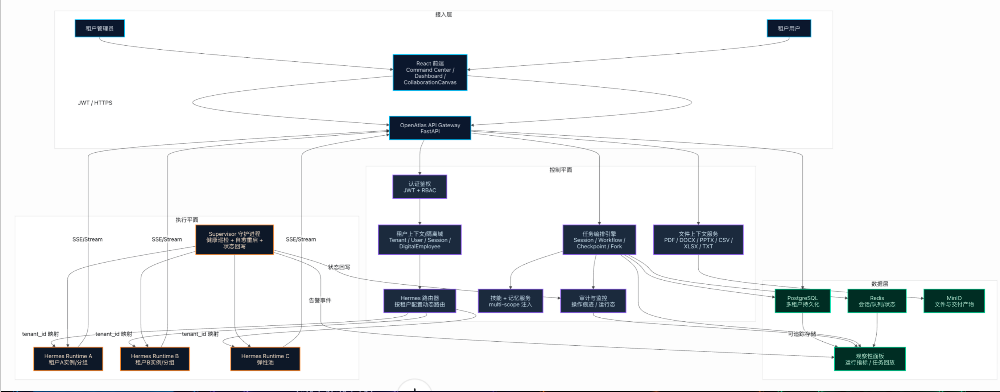

# Atlas One

<div align="center">

  <h3>Atlas One · Enterprise AI Workforce Platform</h3>

  <p>
    编排、协作、交付。高效管理数智团队，精准交付业务结果。
  </p>

  <p>
    
    
    
    
  </p>

  <p>
    <a href="http://124.222.146.231">在线试用</a>
    ·
    <a href="http://124.222.146.231/openatlas-trial-guide-20260621/">试用指南</a>
    ·
    <a href="https://github.com/davidwang960707-gpu/Atlas-One/issues">反馈问题</a>
  </p>

</div>

---

## 一句话定位

**Atlas One 是面向个人 AI PC 用户、初创团队和企业场景的 B/S 数智员工平台。**

它不是单一聊天机器人，也不是简单的 Agent WebUI，而是把 LLM 对话提升为可管理、可追踪、可恢复、可交付的任务执行平台。

Atlas One 将模型、工具、文件、记忆、Skill、审批、审计和交付物组织到同一套企业运行模型里，让用户可以像调度真实团队一样调度一支 AI 数字员工队伍。



## 这是什么

在 Atlas One 里，Agent 不只是一个可以聊天的模型窗口，而是被平台化管理的数字员工：

- 有岗位身份：姓名、部门、职责、工作边界。
- 有能力配置：Skill、知识、文件上下文、工具权限、任务范围。
- 有运行约束：哪些能做、哪些不能做、哪些需要审批。
- 有过程记录：任务、对话、工具调用、运行事件、交付物可以追溯。
- 有平台治理：招聘、上岗、调度、协作、归档、停用由平台统一管理。

Atlas One 关注的不只是“模型回复了什么”，而是“任务是否完成、过程是否可信、产物是否可用、后续是否能复盘”。

## 核心理念

Atlas One 围绕三个关键词设计：

- **编排**：把复杂任务拆解给合适的数字员工，让能力、上下文和任务路径有序流转。
- **协作**：让不同岗位的数字员工围绕同一业务目标接力工作，而不是各自孤立回答。
- **交付**：以最终业务结果为导向，关注任务是否完成、产物是否清楚、过程是否可追踪。

对个人 AI PC 用户和初创团队来说，Atlas One 希望提供一套轻量但可靠的数智团队管理入口：不需要从零搭建模型、权限和运行环境，就能让数字员工围绕真实业务目标开展工作。

## 技术创新点

### 1. 企业级数字员工平台，而非单一聊天机器人

Atlas One 把 LLM 对话抽象为“任务执行平台”。每一次任务都可以绑定租户、用户、会话、数字员工、Skill、文件上下文、记忆和交付物，并在运行过程中持续记录状态、事件和产出。

这让平台具备企业级管理维度：

- 谁发起了任务；
- 哪个数字员工执行；
- 使用了哪些 Skill、文件和记忆；
- 当前任务处于什么阶段；
- 是否产生可下载、可预览、可归档的交付物；
- 出错后能否恢复、重试、接力或继续。

### 2. 完整 B/S 企业架构与工程化后端能力

Atlas One 采用完整 B/S 架构，而不是让每个用户在自己的本机上各自运行一套 Agent。

- 前端使用 React、TypeScript、Vite，提供工作台、数字员工、技能中心、创意白板、对话历史和管理视图。
- 后端以 FastAPI、SQLAlchemy、Alembic 迁移体系为核心，承载会话、权限、文件、任务、审计和运行状态。
- 数据与基础设施围绕 PostgreSQL、Redis、MinIO 组织，分别服务于多租户持久化、队列/状态、文件与交付物存储。
- 工程侧提供健康检查、运行诊断、日志审计、任务状态回写和自动化 smoke/E2E 检查。

平台不是前端套一层聊天框，而是把认证、权限、文件、会话、审计、运维和交付物管理纳入同一条业务链路。

### 3. 多租户 Hermes 网关路由与运行时治理

Atlas One 将 Hermes Gateway 作为底层 Agent 运行时，并在上层增加租户级路由和治理能力：

- 通过 `tenant_id` 动态路由到不同 Hermes Runtime 或运行分组；
- 支持租户、用户、会话、数字员工维度的上下文隔离；
- 通过 supervisor 守护网关进程，进行健康检查、异常重启和状态回写；
- 通过 SSE/Stream 回传运行事件，让前端可以展示长任务进展和执行阶段。

这让平台既能复用 Hermes 的 Agent 能力，又能满足企业场景下的隔离、可用性和可观测性要求。

### 4. 安全与合规内建

Atlas One 从架构层内置安全治理能力：

- JWT 鉴权与角色权限控制；
- API Key 与敏感字段加密存储；
- 文件上传安全校验与租户/用户隔离；
- 高风险操作审批、确认与任务状态机；
- 审计日志、运行轨迹、工具调用和交付物记录可追踪。

这些能力让数字员工不只是“能做事”，而是“能在企业规则下做事”。

### 5. 记忆、Skill、文件上下文统一注入

Atlas One 将记忆、Skill 和文件统一纳入任务上下文：

- 记忆支持全局、租户、用户、会话等多级作用域；
- Skill 可按全局、租户、员工等范围安装、启停和绑定；
- 上传文件可抽取文本并注入会话上下文；
- 前端可展示本轮实际注入了哪些 Skill、文件、记忆和用户输入来源。

这套机制让 AI 能力从“临场 Prompt”升级为可治理、可复用、可审计的企业知识增强流程。

### 6. 任务可恢复的协作工作流

Atlas One 将复杂任务拆解为可追踪的工作流节点：

- 记录节点事件、思考摘要、工具调用、文件变化、审批状态和执行结果；
- 支持 checkpoint、fork、重试、继续执行和运行恢复；
- 前端协作画布可以查看节点进展、回放任务轨迹，并将方案保存为可复用协作流程。

这让长任务不再是黑盒式等待，而是可以被观察、干预和恢复的执行过程。

### 7. 可观测性与交付闭环

Atlas One 将对话、工具调用、运行事件、文件、交付物、审计日志统一持久化：

- 聊天区展示任务阶段、等待状态和工具调用；
- 右侧栏展示任务状态、输入来源、会话总结和交付物；
- 交付物支持在线预览、下载、归档和继续追问；
- 管理侧可追踪会话、员工、Skill、文件和运行健康。

平台最终关注的是“任务是否完成、交付物在哪里、过程是否可信、后续能否复盘”。

## 对外表达的核心创新

| 创新方向 | 说明 |
| --- | --- |
| 聊天即业务编排 | 把对话转化为可追踪、可恢复、可交付的任务流程，而不是一次性回复。 |
| 数字员工 + 角色化能力编排 | 以数字员工为执行单元，绑定工具、Skill、记忆、组织权限和交付规范。 |
| 可视化协作编排 | 通过创意白板和协作画布组织多员工流程，前端画布与后端运行态联动。 |
| 高可靠企业运行模型 | 在 AI 能力之外提供网关自愈、状态恢复、审批门禁、审计闭环和交付物治理。 |

## 架构分层

Atlas One 分为四个核心层次：

| 层级 | 说明 |
| --- | --- |
| 接入层 | 租户管理员、租户用户、React 前端、OpenAtlas API Gateway。 |
| 控制平面 | 认证鉴权、租户上下文隔离、Hermes 路由、任务编排、Skill/记忆服务、文件上下文、审计监控。 |
| 执行平面 | Hermes Runtime、Supervisor 守护进程、SSE/Stream 事件回传、状态恢复。 |
| 数据层 | PostgreSQL、Redis、MinIO、观察性面板与交付物存储。 |

<details>
<summary>查看架构关系草图</summary>



</details>

## 和普通 Agent/类 Claw 产品的区别

| 维度 | 通用 Agent/本地 WebUI | Atlas One |
| --- | --- | --- |
| 部署方式 | 本机运行、个人配置 | B/S 架构、服务端统一承载 |
| 模型服务 | 用户自行配置模型或 Key | 平台侧统一接入、统一调度、统一治理 |
| 使用对象 | 单个用户、单个 Agent | 企业团队、多名数字员工 |
| 安全边界 | 依赖本地环境和个人习惯 | 平台统一权限、审计和控制 |
| 数据归属 | 文件、会话、记忆多在本地 | 企业侧集中管理和追踪 |
| 能力组织 | 工具和模型围绕个人使用 | Skill、知识、工具围绕岗位配置 |
| 管理视角 | 个人工作台 | 数字员工队伍与组织治理 |
| 信任机制 | 相信使用者自己管好 | 平台让过程可见、权限可控、结果可追溯 |

Atlas One 的重点不是“把 Agent 放进浏览器”，而是把 Agent 能力变成企业能放心使用、能持续管理的数字劳动力。

## 在线试用

Atlas One 仍处于预览阶段，功能、界面和部署方式都会持续变化。

当前试用环境由平台侧预先配置好数字员工、模型服务和基础运行策略。预览版优先开放核心体验：进入平台、选择或调度数字员工、发起任务、观察流式响应、查看员工身份、任务上下文和交付物。

```text
试用地址：http://124.222.146.231
演示账号：demo@demo.openatlas
密码：openatlas
试用指南：http://124.222.146.231/openatlas-trial-guide-20260621/
```

后台管理能力会逐步开放。当前阶段更重视真实可用的主路径，而不是把所有企业功能一次性铺满。

## 试用说明

目前试用环境部署在资源有限的虚拟机上，所以体验时可能出现：

- 首次访问稍慢；
- 高峰期响应变慢；
- 大任务执行时间较长；
- 偶尔需要刷新或稍后再试。

欢迎来试，欢迎认真挑刺。

## 适合谁关注

- 正在关注 AI Agent 企业落地的人；
- 想把 AI 从“聊天助手”推进到“数字员工”的人；
- 需要用数智团队提升交付效率的个人 AI PC 用户和初创团队；
- 需要企业内部 AI 工作台、审计、权限和流程治理的人；
- 关注 B/S 架构下 Agent 安全运行与集中管控的人；
- 想观察一个 AI 原生企业产品从预览版逐步长出来的开发者、设计师和产品同学。

## 反馈方式

欢迎通过 GitHub Issues 留下反馈。

如果你遇到问题，可以尽量附上：

- 发生问题的大致时间；
- 你当时正在尝试的操作；
- 页面提示或错误现象；
- 是否可以稳定复现。

如果只是产品建议，也完全可以直接说人话，不需要写成正式报告。比如“这个员工不像员工，更像套了名字的聊天机器人”这种反馈就很有价值。

## License

本仓库当前用于 Atlas One 项目入口页与公开说明，暂不包含完整项目源码。

---

<div align="center">

  <b>Atlas One：让 Agent 成为企业可管理、可控、可信的数字员工。</b>

</div>
